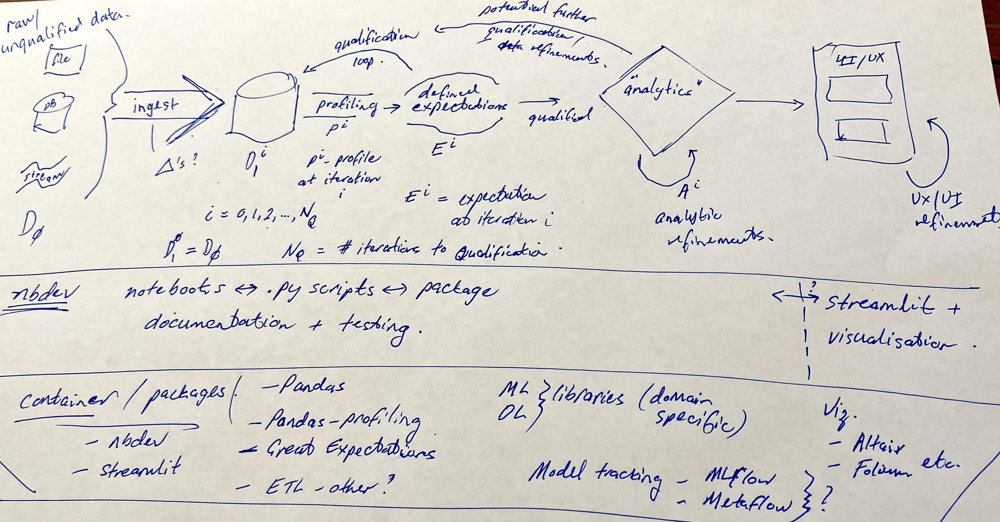

# Title

###### Titanic package

> Titanic package to try out development using `nbdev` package.

The use of the "Titanic Dataset" is like the `Hello World` of Data Science in many ways. See my [blog post - Did a male octogenarian really survive the sinking of the RMS Titanic?](https://databooth.com.au/blog/did-a-male-octogenarian-really-survive-the-sinking-of-the-rms-titanic/).

Basically this (simple) working example is meant to demostrate the architecture/workflow that DataBooth employs in its framework for helping small to medium enterprises marshall, understand and create additional value from their data assets.

A (currently hand-drawn) diagram of the overall framework is shown below:

## Install

`pip install hello_titanic`

## How to use

Fill me in please! Don't forget code examples:
